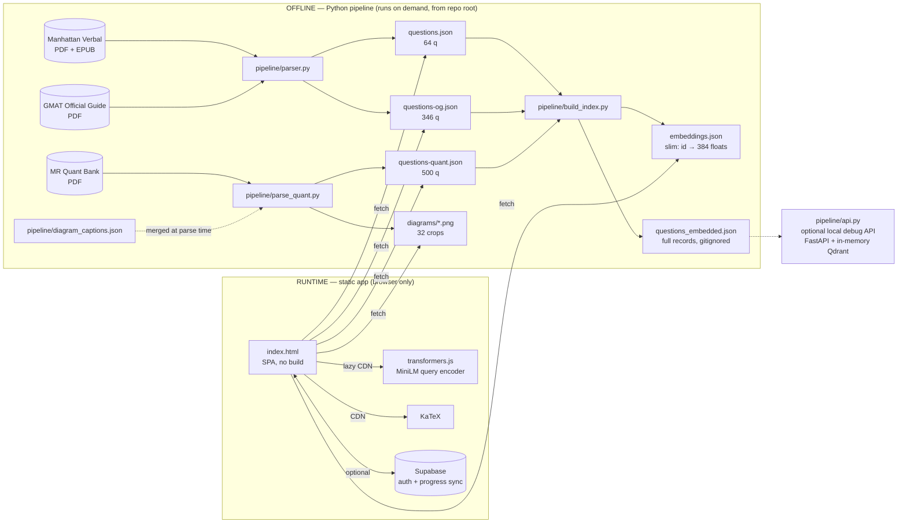

# GMAT Trainer — Design Document (HLD + LLD)

*Last updated: 2026-07-13. Reflects the restructured repo (app at root, tooling in
`pipeline/`, docs in `docs/`, explorations in `prototypes/`).*

---

## 1. System overview

A personal GMAT practice system with two halves that never run at the same time:

- an **offline extraction pipeline** (Python) that turns source prep books (PDF/EPUB,
  kept outside the repo) into verified JSON question banks + embeddings, and
- an **online study app** (`index.html`, one static file) that consumes those JSON
  artifacts in the browser.

The two halves are coupled **only through data files with a fixed schema**. There is
no build step, no bundler, and no required backend.

### Design goals (in priority order)
1. **Source fidelity** — never invent or alter a question/answer; anything
   unconfirmable ships as `null` (`needs_review: true`). Every answer is confirmed by
   **two independent signals** before it is shipped.
2. **Zero-infrastructure runtime** — the app must run from any static host (Vercel)
   or a local `http.server`; every optional service (Supabase, vector API) degrades
   silently when absent.
3. **Local-first progress** — study history lives in `localStorage`; cloud sync is
   an optional enhancement, never a requirement.
4. **Correctness over volume** — a smaller verified bank beats a larger doubtful one.

---

## 2. High-level design

### 2.1 Context diagram



### 2.2 Components and responsibilities

| Component | Tech | Responsibility | Depends on |
|---|---|---|---|
| `pipeline/parser.py` | pdfplumber, BeautifulSoup, PyMuPDF | Extract Manhattan Verbal (PDF primary + EPUB oracle) and OG Verbal (fitz) into schema JSON; cross-validate answers | source books (local only) |
| `pipeline/parse_quant.py` | PyMuPDF | Extract MR Quant PS/DS; LaTeX reconstruction; diagram crop + caption merge; answer-key vs solution-marker cross-check | source book, `diagram_captions.json` |
| `pipeline/gmat_parsing_common.py` | sentence-transformers | Shared text normalization (`SMART` map) + `embed_questions()` (all-MiniLM-L6-v2, 384-d) | — |
| `pipeline/gmat_schema.py` | pydantic | `validate_records()` gate — no invalid record is ever written | — |
| `pipeline/build_index.py` | — | Merge 3 banks, tag `bank`, re-embed, write `questions_embedded.json` (full) + `embeddings.json` (slim, shipped) | the 3 bank files |
| `pipeline/eval_retrieval.py` | — | Retrieval quality report (consistency@5, weak queries, near-dups) | `questions_embedded.json` |
| `pipeline/api.py` | FastAPI, Qdrant (`:memory:`) | **Optional** local search API + static file server. The app no longer calls it; kept for retrieval debugging | `questions_embedded.json` |
| `index.html` | vanilla HTML/CSS/JS, KaTeX, transformers.js | The entire study UI: modes, adaptive engine, analytics, in-browser vector search, theming | the JSON artifacts |
| Supabase (external) | supabase-js CDN | Optional email/Google auth + `progress` row per user (RLS) | — |
| `tests/` | pytest | Regression suite over parser helpers + schema (63 tests; no source books needed) | pipeline modules |

### 2.3 Data-flow contract (the seam between the halves)

The pipeline and the app agree on exactly four artifacts, all at repo root:

1. `questions*.json` — arrays of question records (schema §3.1). App `fetch()`es the
   banks — all three are fetched at boot and merged into one pool (`App.all`, 910 q).
2. `embeddings.json` — `{question_id: [384 floats]}`, L2-normalized. App loads it
   lazily for Smart search / similar questions.
3. `diagrams/*.png` — referenced by each record's `diagram` path.
4. (pipeline-internal) `questions_embedded.json` — full records + vectors + `bank`
   tag; consumed only by `api.py`/`eval_retrieval.py`; gitignored.

**Rule: all pipeline scripts run from the repo root** so their cwd-relative outputs
land where the app fetches them.

### 2.4 Deployment view

| Environment | What runs | How |
|---|---|---|
| Local study | `start-app.bat` → `start_app.py` (auto-port http.server) or `python -m http.server 8000` | serves repo root |
| Local + AI debug | `python pipeline/api.py` | FastAPI :8000, serves the app *and* the Qdrant search endpoints from one origin |
| Production | **Vercel** (static) | `.vercelignore` strips everything but `index.html`, bank JSONs, `embeddings.json`, `diagrams/` |
| Sync backend | Supabase project (Seoul) | Google/email auth; `progress` table with row-level security |

### 2.5 Key architectural decisions

| Decision | Why | Trade-off accepted |
|---|---|---|
| Single-file app, no build step | Zero toolchain; trivially deployable; easy to hand-edit | `index.html` is ~1,360 lines and growing; split only when it actually hurts |
| Dual-signal answer verification (PDF vs EPUB; key vs explanation marker) | Anti-hallucination guarantee — caught a real book error (`rc-ch15-q9`) | Some answers ship `null` when signals disagree (4 quant conflicts) |
| Precomputed corpus vectors + **on-device query encoding** (transformers.js) | Vector search on a static host; no server, no API keys; query + corpus share one model (MiniLM) | ~25 MB model download on first search (browser-cached after) |
| localStorage-first, Supabase optional | App never blocks on network; guest mode is first-class | Merge logic needed (`mergeProgress`) when a user signs in on a second device |
| In-memory Qdrant in `api.py` | 910 questions ≈ 10 MB; Docker would be overkill | Index rebuilt on every start (seconds) |
| Data files at repo root (not `data/`) | Diagram paths are baked into shipped JSON; root **is** the deploy unit | Slightly busier root listing |

---

## 3. Low-level design

### 3.1 Question record schema (the core data structure)

Shared by all three banks; the app ignores unknown keys.

| Field | Type | Notes |
|---|---|---|
| `id` | str | `{cr\|rc}-ch{n}-q{n}`, `og-{rc\|cr}-q{NNN}`, `{ps\|ds}-{topic}-q{NNN}` — stable keys for history |
| `type` | `CR\|RC\|PS\|DS` | drives UI branching (`isQuant()`) |
| `chapter` | str | Manhattan: chapter; OG: difficulty band; Quant: topic label |
| `title` | str/null | CR topic label |
| `question` | str | stem; quant may contain inline `$math$` for KaTeX |
| `passage` | str/null | RC only; `\n\n` paragraph breaks preserved |
| `options` | `[{label:"A"–"E", text}]` | DS options are the 5 hardcoded standard choices |
| `correct_answer` | `"A"–"E"`/null | null ⇒ `needs_review: true`; never guessed |
| `explanation` | str | book's own explanation, formatted not flattened |
| `format` | `"multiple_choice"` | constant |
| OG extras | `subtype`, `category`, `difficulty`, `number`, `source` | subtype: RC verbatim from book; CR inferred conservatively from stem |
| Quant extras | `number`, `source`, `needs_review`, `source_page`, `diagram`, `diagram_description(+_source)` | caption used only as embedding text, never displayed |
| `embedding` | `[384 floats]` | added by `embed_questions()`; app ignores it (uses `embeddings.json` instead) |

Validation: every parser calls `gmat_schema.validate_records()` (pydantic) before
writing; invalid output aborts the run (`sys.exit(1)`).

### 3.2 Pipeline internals

**parser.py** — three backends behind one schema, dispatched in `main()`:
- `parse_pdf` (pdfplumber) — source of record for Manhattan; structural anchors
  (numbered line is a question only if `(A)` appears before the next number).
- `parse_epub` (BeautifulSoup) — independent oracle; `cross_check()` matches
  confirmed answers by normalized text; `merge_format_from_oracle()` borrows EPUB
  formatting **without ever changing a PDF answer**.
- `parse_og` (fitz) — OG Focus Edition; sections located by heading text
  (`_og_find_sections`), each section reader includes the next section's first page
  (spill); two intra-file answer signals (numbered key vs `(X)... Correct.` marker);
  conflicts ship `null`.

**parse_quant.py** — key mechanisms (each guards a past regression):
- *Sequential-number guard*: `N.` starts a question only if `N == prev+1`
  (kills phantom questions from wrapped numbers, e.g. Q24's "…excess of\n40.").
- *LaTeX reconstruction* from span metrics: superscript = `size < 8.0` **and**
  `dom_y − span_y > 2.0` (y-check kills page-number false positives); `\x12/\x13`
  control chars = fraction delimiters; `√` → `\sqrt{}`; prose stays unwrapped.
- *Diagram interval assignment*: each question owns the document span from its own
  `(page, y)` start to the next question's; drawings cluster by 12 pt proximity; a
  cluster is assigned to the interval containing its y-midpoint, cropped at 200 DPI.
  Never filter by `rect.is_empty` (kills number lines); skip pure-white fills and
  all-thin-bar clusters; absorb short text labels within a 14 pt halo.
- *Solutions*: `_SOL_QNUM_RE = ^(\d+)\.(?!\d)` (lookahead skips "5.1" headings);
  DS solutions loaded with `min_q=251` so sub-point "2. – Sufficient" can't
  overwrite PS Q2.
- *Caption merge*: `pipeline/diagram_captions.json` (path resolved relative to the
  script file) merged into `diagram_description` at parse time — survives re-parses.

**build_index.py** — merge → tag `bank` (`og|manhattan|quant`, must match the app's
`BANKS` map) → assert id uniqueness → re-embed with the shared recipe
(`title + question + diagram_description[:300] + passage[:500] + options[:300]`,
cap 1000 chars — caption placed early so it fits MiniLM's ~256-token window) →
write both indexes.

**api.py** (optional) — loads `questions_embedded.json` into Qdrant `:memory:` at
startup; endpoints `/health`, `/search-similar/{id}`, `/search?q=`, `/chapters`,
`/questions/{id}`; payload filters for bank/type/chapter/difficulty; uses
`client.query_points()` (v1.7+ API — do not revert to removed `client.search()`);
mounts `StaticFiles(directory=".", html=True)` **last** so API routes win.

### 3.3 App internals (`index.html`)

One `<script>` with small module-like IIFEs and plain functions:

```
┌──────────────────────── index.html ────────────────────────┐
│ head: pre-paint theme script · Supabase CDN · KaTeX CDN     │
│ body: 8 <section class="screen"> panes (one visible at a   │
│       time via show(id)): landing → home → menu → setup →  │
│       run → report │ dash │ settings                       │
├────────────────────────── JS ──────────────────────────────┤
│ BANKS map          bank key → file + label (matches build) │
│ Store (IIFE)       localStorage 'gmat_verbal_v1':          │
│                    history{qid→…} · daily · adaptive       │
│                    record() · overall() · byField() ·      │
│                    adaptLevel (≥75% up, <50% down)         │
│ Sync (IIFE)        Supabase auth + progress row;           │
│                    mergeProgress(local,remote) on sign-in  │
│ Attempts (IIFE)    per-attempt telemetry rows (optional)   │
│ App (object)       runtime state: all[] source mode qs idx │
│                    answers flags checked qTimes timer      │
│ nav                stack[] + navTo()/navBack() + show()    │
│ screens            renderLanding/Home/Menu/Setup/Q/…       │
│ runner             resetRun→startRun→renderQ→pick→submit   │
│                    →finish→buildRepList                    │
│ adaptive           buildPassages/pickPassage (RC-only)     │
│ vector client      loadEmbeddings() → EMB Map ·            │
│                    cosine/vecSimilar/vecSearch ·           │
│                    getExtractor() lazy transformers.js ·   │
│                    showSimilarForCurrentQ() · doSearch()   │
│ theme              data-theme attr, set pre-paint          │
│ boot               loadAll() → renderLanding() → Sync.init │
└─────────────────────────────────────────────────────────────┘
```

**Screen state machine** (each box = a `<section>`; `show(id)` swaps visibility,
`stack[]` gives Back):

```
landing(splash→auth) → home ─┬→ menu(section) → setup → run ⇄ (flag/nav) → report
                             ├→ dash (analytics + smart search results)
                             └→ settings (export/import/reset, account)
```

**Answer-submission sequence** (non-exam modes):

```
user taps option → pick(label)            [stores answer, enables Submit]
user taps Submit → updateAct()/submit
  ├─ Store.record(q, picked, correct)     → localStorage write
  │    └─ Sync.onLocalChange(data)        → debounced Supabase upsert (if signed in)
  ├─ Attempts.saveAttempt(q, label, ms)   → telemetry row (if signed in)
  ├─ feedback UI: correct/incorrect, explanation, subtype badge (post-answer only)
  └─ showSimilarForCurrentQ()
       ├─ loadEmbeddings()                → fetch embeddings.json once (force-cache)
       ├─ vecSimilar(q.id, 3)             → dot products over all 910
       └─ render sim-panel (click: jump if in-session, else alert preview)
```

**Smart search sequence**:

```
input (≥3 chars, 400 ms debounce) → doSearch(q)
  → loadEmbeddings() → getExtractor()  [lazy import transformers.js, ~25 MB once]
  → embedQuery(text)  [mean-pool + normalize → Float32Array(384)]
  → vecSearch(qv, 8)  [dot product over App.all — all 910, every bank]
  → render results; click → 1-question Practice session
```

**Storage keys** (all localStorage):
| Key | Contents |
|---|---|
| `gmat_verbal_v1` | `{version, history{qid→{lastResult,type,subtype,chapter,…}}, daily{date,level,streak,…}, adaptive{level}}` |
| `gmat_theme` | `"light"\|"dark"` — deliberately not synced |

**Degradation matrix** (goal 2 — every row must stay true):

| Missing/failing | Behavior |
|---|---|
| `embeddings.json` absent | Smart search + similar panel silently absent; study unaffected |
| transformers.js CDN blocked | search shows "couldn't load model" status; rest unaffected |
| Supabase blank/CDN down | guest mode; local-only progress |
| KaTeX CDN down | quant stems render raw `$…$` text (readable) |
| `api.py` not running | irrelevant — app never calls it |

### 3.4 Cross-cutting invariants (do not regress)

1. Two independent signals per shipped answer; disagreements ship `null`.
2. `clean_paras` (not `clean`) for passages/explanations — paragraph breaks are data.
3. Bank keys in `build_index.py` must equal the app's `BANKS` keys.
4. Quant ids changed 2026-07-04 (`ps-pro-t-loss-*` → `ps-profit-loss-*`) — old saved
   quant history is orphaned; never "fix" by renaming ids again without a migration.
5. ASCII-only prints in pipeline scripts (Windows CP1252 terminals).
6. App data fetches use `{cache:"no-cache"}`; `embeddings.json` uses `force-cache`
   (regenerating it changes contents rarely; bump strategy: rename if it bites).

---

## 4. Known gaps / next steps

| # | Item | Severity |
|---|---|---|
| 1 | Similar-panel click on an out-of-session question showed a raw `alert()` preview — fixed 2026-07-13: it now inserts the question right after the current one in the session. | Fixed |
| 2 | Google OAuth client secret stale in Supabase (sign-in flow unverified end-to-end). | Medium |
| 3 | `api.py` duplicates search logic that has since moved into the browser — fine as a debug tool, but don't extend both; the browser path is canonical. | Info |
| 4 | `index.html` at ~1.4k lines is still manageable; if it grows past ~2k, split CSS and the vector client into separate files (still no build step). | Info |
